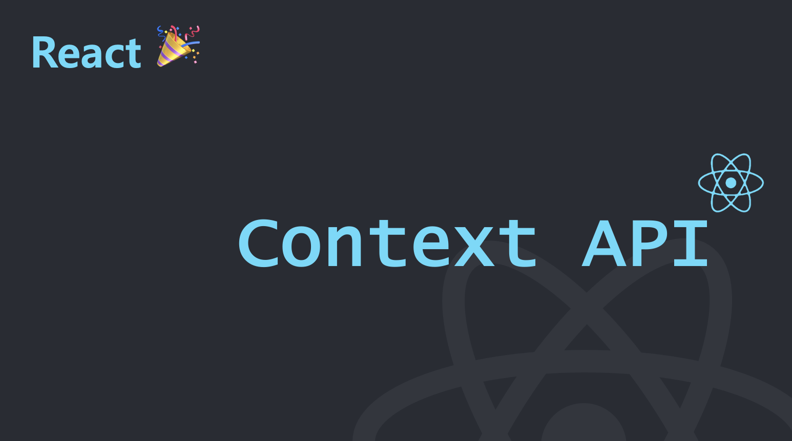

    

<h1></h1>

  
  

  <a href="#-desenvolvimento">Desenvolvimento</a>&nbsp;&nbsp;&nbsp;|&nbsp;&nbsp;&nbsp;
  <a href="#-Instalação-e-execução">Instalação e execução</a>

## 🧑‍🔧 Desenvolvimento

- [Vite](https://vitejs.dev/)
- [TypeScript](https://www.typescriptlang.org/)

## 🧩 Instalação e execução

### Instale todas as dependências
    $ yarn

### Execute localmente
    $ yarn dev

## Autor

<a href="https://www.linkedin.com/in/rodrigo-barbosa-7a1429157/">
 
    <b>Rodrigo Barbosa</b>
 
</a>
<a href="#" title="Rocket">🚀</a>

  
  

<Feito com 💙 />
